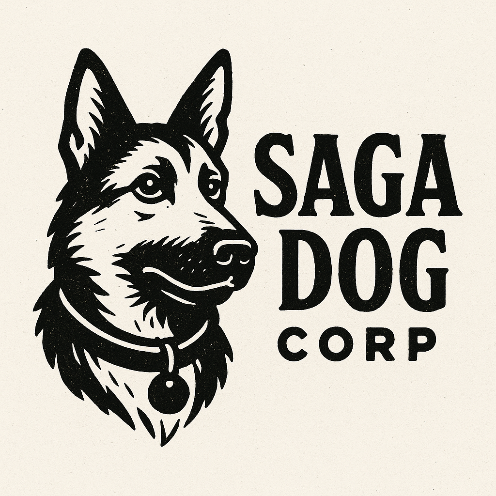

# 🐾 Saga Dog Corp

**Welcome to the official GitHub space of Saga Dog Corp** — a bold experimental lab and software initiative exploring the crosswinds of intelligence, identity, and narrative. Born at the intersection of storytelling, AI, and networked autonomy, Saga Dog Corp plays with form, function, and futurity.

## 🌐 Mission

To design technologies and tools that narrate, negotiate, and navigate the messy entanglements of:
- Collective memory
- Embedded intelligence
- Social forensics
- Autonomous agency

Saga Dog Corp investigates how *sagas* — extended, layered, conflicting accounts — can serve as the foundation for software protocols, ethical engines, and strategic AI deployment in contested information terrains.

## 🧰 Core Projects

| Project | Description |
|--------|-------------|
| [`mosquito`](https://github.com/pacobaco/neuromart) | IP tagging + verification system embedded in narrative flow and surveillance-aware networks |
| [`snapsentinel`](https://github.com/pacobaco/snapsentinel) | A centralized screenshot + behavioral analytics tool for distributed edge observations |
| [`tpse`](https://github.com/pacobaco/tpse) | A PIN-based RPG for social role analysis and system modeling |
| [`shared_auth_collab`](https://github.com/pacobaco/shared_auth_collab) | Multi-user AI simulation environment with Sybil resistance strategies |
| `Big Fly Framework` | Real-time enclave risk detection & memory-mapped banter strategies for geopolitical AI awareness |
| `Marriage Scout` | Identity vetting through relational and economic proxy indicators for sociological simulations |

## 🧠 Themes We Probe

- AI-mediated autobiography
- Post-veracity modeling
- Symbolic counterinsurgency
- Enclave detection & banter weaponization
- Narrative automation ethics

## 🕳️ Organizational Philosophy

We operate from a post-disciplinary, memory-integrated foundation. Our mascot, the **Saga Dog**, is a mythic surveillance hound — loyal, unpredictable, always sniffing through the debris of history for forgotten code.

**No data is neutral. No tool is without a story.**

## 🗂️ Meta

- **Owner:** [@pacobaco](https://github.com/pacobaco)
- **Location:** Decentralized but spiritually headquartered in the signal void
- **Licensing:** Project-specific (default MIT unless stated otherwise)
- **Contact:** Open issues in relevant repos or transmit via the Story Canal™

---

> 🐕 *"Every saga needs a witness. Every witness becomes part of the saga."*

---
